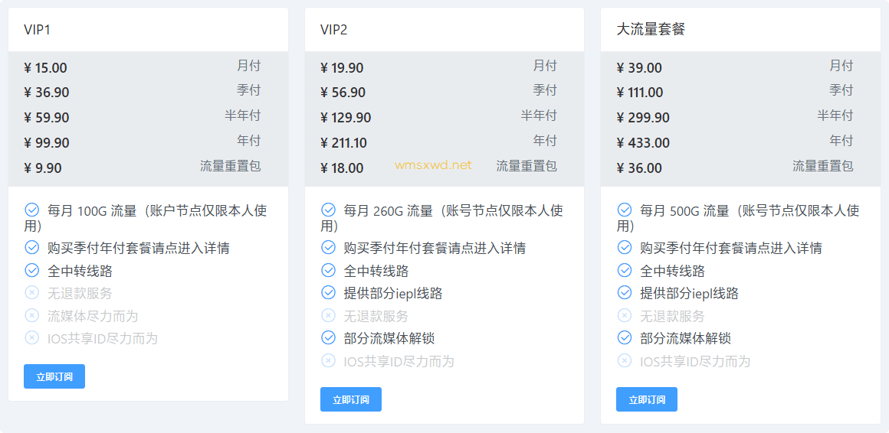

# wmsxwd机场 我们所向往的官网最新入口地址

最新地址1：[https://wmsxwd-3.men](https://wmsxwd-3.men/#/register?code=gZzLEaYp)

或者

[wmsxwd 我们所向往的机场官网备用地址](https://xuv.cc/out/wm)

## wmsxwd 我们所向往的介绍

wmsxwd 我们所向往的机场已经稳定运行多年，支持 Clash 节点，支持 SSR 节点，支持 V2ray 节点，国内中转节点。支持常用主流软件app直接订阅节点。

## wmsxwd 我们所向往的怎么样？

wmsxwd 我们所向往的机场，全球30+国家接入, 支持IEPL专线, SS协议, 全节点解锁奈菲等流媒体。

使用隧道中转优化线路与IPLC国际专线，抗封锁能力强，多条的优质线路节点主要集中在美国、日本、香港、台湾、新加坡、马来西亚、韩国、法国等中国用户常用国家与地区。

## wmsxwd 我们所向往的优惠码

价格已经很优惠了，目前我们所向往的暂时没有优惠码。

## wmsxwd 我们所向往的机场套餐价格

[低至￥8.5/月](https://xuv.cc/out/wm)

> VIP1 套餐：12.9元/月，100G流量/月，全中转线路；
> 
> VIP2 级套餐： 19.90元/月，260G流量/月，保证流媒体解锁，全中转+IEPL线路；
> 
> 大流量套餐：39元/月，500G流量/月，保证流媒体解锁，全中转+IEPL线路；

